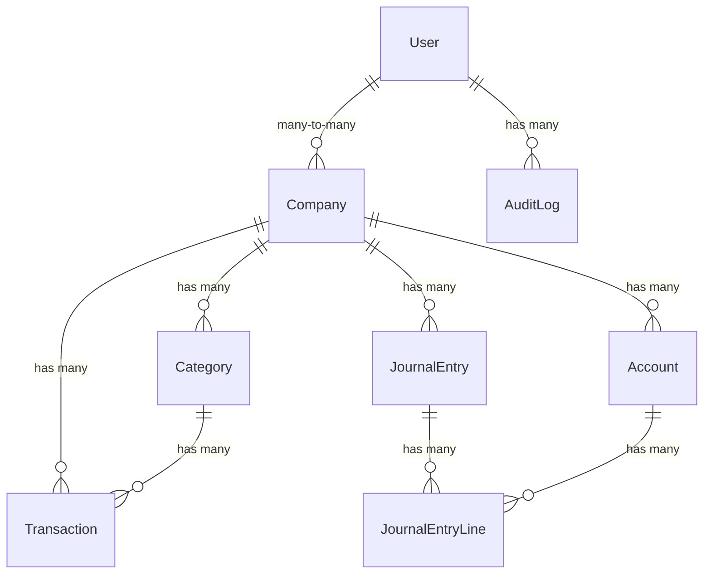
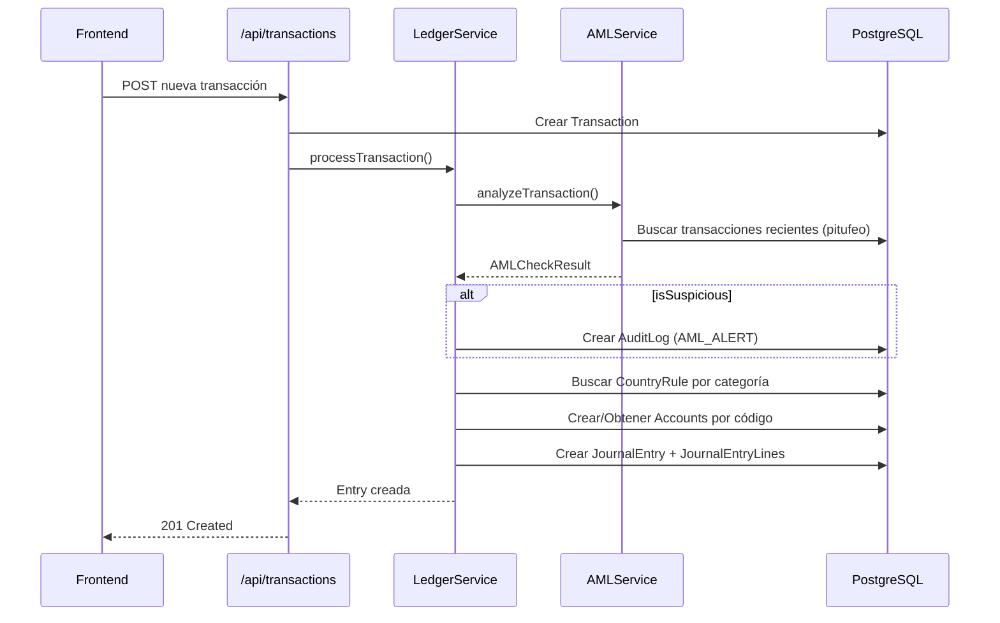

# 📋 CONTA2GO — Documento de Seguimiento y Handoff

> **Fecha:** 27 de Febrero 2026  
> **Propósito:** Este documento detalla el estado completo del proyecto para que otro modelo/agente pueda retomar el desarrollo con total contexto.  
> **Rama activa:** `main` (única rama, no hay feature branches)  
> **Repositorio:** GitHub → `puntocero-dot/Patrimonium_Pro`  
> **Deploy:** Vercel (configurado pero pendiente de estabilización)

---

## 1. 🏗️ ARQUITECTURA GENERAL

### Stack Tecnológico

| Capa | Tecnología | Versión |
|---|---|---|
| Framework | Next.js (App Router) | 16.0.10 |
| Lenguaje | TypeScript | ^5 |
| UI | React + CSS Modules | 19.2.0 |
| ORM | Prisma | 5.22.0 |
| Base de Datos | PostgreSQL (Supabase) | — |
| Autenticación | Supabase Auth (JWT) | ^2.86.0 |
| Encriptación | AES-256-GCM nativo Node.js | — |
| Validación | Zod | ^4.1.13 |
| Sanitización | DOMPurify | ^3.3.0 |
| Deploy | Vercel | v2 |
| CI/CD | GitHub Actions | — |

### Estructura de Directorios Principal

```
Conta_2go/
├── src/
│   ├── app/
│   │   ├── (dashboard)/          ← Layout con sidebar (grupo de rutas)
│   │   │   ├── layout.tsx        ← Sidebar profesional con roles
│   │   │   ├── layout.module.css
│   │   │   ├── dashboard/        ← Página principal del dashboard
│   │   │   ├── companies/        ← Gestión de empresas
│   │   │   ├── clients/          ← CRM - Gestión de clientes
│   │   │   ├── transactions/     ← Ingresos y egresos
│   │   │   ├── reports/          ← Reportes financieros
│   │   │   └── invisible-ledger/ ← Página de "Bienestar" (Contabilidad Invisible)
│   │   ├── api/
│   │   │   ├── auth/             ← 5 sub-rutas de autenticación
│   │   │   ├── companies/        ← CRUD de empresas
│   │   │   ├── clients/          ← CRUD de clientes
│   │   │   ├── transactions/     ← CRUD + Ledger automático
│   │   │   ├── reports/          ← Generación de reportes
│   │   │   ├── audit/            ← Logs de auditoría
│   │   │   ├── mfa/              ← Setup MFA/TOTP
│   │   │   ├── users/            ← Gestión de usuarios
│   │   │   ├── health/           ← Health check
│   │   │   └── debug-env/        ← Debug de variables de entorno
│   │   ├── login/                ← Página de login
│   │   ├── register/             ← Página de registro
│   │   ├── mfa-setup/            ← Setup de MFA
│   │   ├── security-dashboard/   ← Dashboard de seguridad (SUPER_ADMIN)
│   │   ├── globals.css           ← Variables CSS del sistema de temas
│   │   ├── layout.tsx            ← Root layout
│   │   └── page.tsx              ← Página raíz (redirect)
│   ├── components/
│   │   └── ui/
│   │       ├── badge.tsx         ← Componente Badge reutilizable
│   │       └── card.tsx          ← Componente Card reutilizable
│   ├── hooks/
│   │   ├── useAuth.ts            ← Hook de autenticación
│   │   └── useSessionManagement.ts ← Hook de gestión de sesiones
│   ├── lib/
│   │   ├── auth/                 ← 8 archivos de autenticación
│   │   ├── encryption/           ← 2 archivos de encriptación
│   │   ├── validation/           ← 2 archivos de validación
│   │   ├── accounting/           ← Motor de contabilidad (ledger.ts)
│   │   ├── fintech/              ← AML + Bitcoin (2 archivos)
│   │   ├── config/               ← Configuración multi-país
│   │   ├── audit/                ← Servicio de auditoría
│   │   ├── logging/              ← Logging seguro
│   │   ├── supabase/             ← Cliente Supabase
│   │   ├── security/             ← Módulo de seguridad
│   │   └── prisma.ts             ← Singleton Prisma Client
│   └── middleware.ts             ← Security headers (TODOs pendientes)
├── prisma/
│   ├── schema.prisma             ← 9 modelos de base de datos
│   ├── seed_rules.ts             ← Seed de reglas contables SV
│   ├── hardening_supabase.sql    ← SQL de hardening
│   └── migrations/               ← Migraciones de Prisma
├── scripts/
│   ├── security-test.js          ← Tests de seguridad
│   ├── generate-keys.js          ← Generador de llaves
│   ├── country-migration.js      ← Migración multi-país
│   ├── test-db.ts                ← Test de conexión DB
│   └── emergency/
│       ├── full-backup.js        ← Backup completo
│       ├── maintenance-mode.js   ← Modo mantenimiento
│       └── revoke-all-sessions.js ← Revocar sesiones
├── .github/workflows/
│   └── security.yml              ← Pipeline CI/CD (Snyk, SonarQube, OWASP ZAP)
├── vercel.json                   ← Config deploy + security headers
├── package.json                  ← Scripts: dev (puerto 3010), build, etc.
└── [Documentación .md]           ← 6 guías documentadas
```

---

## 2. 📦 BASE DE DATOS — Modelos Prisma

### Esquema completo (`prisma/schema.prisma`)



| Modelo | Descripción | Campos Clave |
|---|---|---|
| **User** | Usuarios del sistema | `id`, `email`, `role` (enum), `mfaEnabled`, `mfaSecret`, `backupCodes`, `passwordChangedAt`, `passwordHistory` |
| **Company** | Empresas registradas | `id`, `name`, `taxId` (encriptado), `country`, `metadata` (JSON: forma jurídica, NRC, dirección) |
| **Transaction** | Transacciones financieras | `id`, `type` (INGRESO/EGRESO), `amount`, `description`, `date`, `categoryId`, `companyId`, `userId`, `attachments`, `metadata` |
| **Category** | Categorías de transacciones | `id`, `name`, `type` (INGRESO/EGRESO), `color`, `icon`, `companyId` |
| **AuditLog** | Registros de auditoría | `id`, `timestamp`, `userId`, `action`, `resource`, `resourceId`, `ipAddress`, `userAgent`, `geoLocation`, `oldData`, `newData`, `result`, `metadata` |
| **Account** | Plan de cuentas contable | `id`, `code` (ej: "1101"), `name`, `type` (Activo/Pasivo/Patrimonio/Ingreso/Gasto), `companyId` — unique constraint `[companyId, code]` |
| **JournalEntry** | Partidas contables (libro diario) | `id`, `date`, `description`, `reference`, `companyId`, `metadata` |
| **JournalEntryLine** | Líneas de partida (debe/haber) | `id`, `journalEntryId`, `accountId`, `debit`, `credit` |
| **CountryRule** | Reglas contables por país | `id`, `country`, `triggerText`, `rules` (JSON: debit, credit, tax, aml_limit) — index `[country, triggerText]` |

### Enums

- **Role:** `SUPER_ADMIN`, `CONTADOR`, `CLIENTE`, `AUDITOR`
- **TransactionType:** `INGRESO`, `EGRESO`

### Relaciones Importantes

- `User` ↔ `Company`: **Many-to-Many** (un usuario puede tener varias empresas)
- `Transaction` → `Category`: Many-to-One
- `Transaction` → `Company`: Many-to-One (cascade delete)
- `JournalEntryLine` → `Account`: Many-to-One
- `JournalEntryLine` → `JournalEntry`: Many-to-One (cascade delete)

---

## 3. 🔐 SISTEMA DE ROLES Y PERMISOS (RBAC)

Definido en `src/lib/auth/rbac.ts`:

| Rol | Permisos | Acceso UI |
|---|---|---|
| **SUPER_ADMIN** | `['*']` — Acceso total | Todas las páginas + Security Dashboard |
| **CONTADOR** | `company:read`, `company:update` (asignadas), `transaction:create/read/update/delete`, `report:generate` | Dashboard, Empresas, Clientes, Transacciones, Reportes |
| **CLIENTE** | `company:read` (propia), `dashboard:read`, `report:export` | Dashboard, su Empresa, Reportes (solo lectura) |
| **AUDITOR** | `company:read`, `transaction:read`, `report:read`, `audit_log:read` | Todo en solo lectura + Logs de auditoría |

### Función de verificación

```typescript
// src/lib/auth/rbac.ts
hasPermission(role: Role, permission: string): boolean
// SUPER_ADMIN siempre retorna true
```

### Filtrado de menú en sidebar

En `src/app/(dashboard)/layout.tsx`, el array `menuItems` define `roles: ['all']` o `roles: ['SUPER_ADMIN']` para filtrar la navegación por rol.

---

## 4. 🔑 SISTEMA DE AUTENTICACIÓN

### Archivos en `src/lib/auth/`

| Archivo | Función | Estado |
|---|---|---|
| `rbac.ts` | Enum `Role`, `PERMISSIONS`, `hasPermission()` | ✅ Completo |
| `session-manager.ts` | Clase `SessionManager` con inactividad 15min, detección de sesiones concurrentes via `BroadcastChannel`, `handlePasswordChange()` | ✅ Completo |
| `password-policy.ts` | Validación de política de contraseñas (12+ chars) | ✅ Completo |
| `password-expiration.ts` | Control de expiración de contraseñas | ✅ Completo |
| `rate-limiter.ts` | Rate limiting (5 intentos/15 min) | ✅ Completo |
| `hibp-validator.ts` | Validación contra HaveIBeenPwned API | ✅ Completo |
| `backup-codes.ts` | Generación y validación de backup codes MFA | ✅ Completo |
| `reauth.ts` | Re-autenticación para acciones sensibles | ✅ Completo |

### API Routes de Auth (`src/app/api/auth/`)

| Ruta | Método | Función |
|---|---|---|
| `/api/auth/register` | POST | Registro de usuarios |
| `/api/auth/validate-password` | POST | Validación de política de contraseñas |
| `/api/auth/check-rate-limit` | GET | Verificación de rate limit |
| `/api/auth/clear-rate-limit` | POST | Limpiar rate limit |
| `/api/auth/record-failed-attempt` | POST | Registrar intento fallido |

### Hooks

- **`useAuth.ts`**: Hook que expone `user`, `role`, `loading` del estado de autenticación Supabase
- **`useSessionManagement.ts`**: Hook que integra `SessionManager` con el ciclo de vida React

---

## 5. 🔒 SISTEMA DE ENCRIPTACIÓN

### `src/lib/encryption/crypto.ts`

- **Algoritmo:** AES-256-GCM
- **Key derivation:** PBKDF2 con 100k iteraciones
- **Funciones exportadas:** `encrypt(plaintext)`, `decrypt(ciphertext)`
- **Variable de entorno:** `ENCRYPTION_MASTER_KEY`

### `src/lib/encryption/encrypted-fields.ts`

- Helpers para encriptar/desencriptar campos específicos del modelo (ej: `taxId` de Company)
- Integración con Prisma middleware para encriptación transparente

---

## 6. 📊 MOTOR DE CONTABILIDAD INVISIBLE

### Flujo Completo (Ledger Service)



### `src/lib/accounting/ledger.ts` — Clase `LedgerService`

| Método | Descripción |
|---|---|
| `processTransaction(input)` | Método principal: ejecuta AML → busca regla contable → genera partida doble con IVA |
| `getAccountIdByCode(companyId, code)` | Busca cuenta o la crea automáticamente ("Auto-setup" para MVP) |
| `getDefaultAccountName(code)` | Mapa de códigos a nombres (1101 → "Caja / Efectivo", etc.) |
| `getAccountType(code)` | Deriva tipo de cuenta por primer dígito (1=Activo, 2=Pasivo, etc.) |

### `src/lib/fintech/aml.ts` — Clase `AMLService`

| Método | Descripción |
|---|---|
| `analyzeTransaction(companyId, amount, description)` | Análisis AML: umbral $10,000 (score +80), detección de fraccionamiento/pitufeo (score +50), keywords sensibles (score +40). Sospechoso si score ≥ 50 |
| `logAlert(companyId, result, transactionData)` | Registra alerta en AuditLog con action `'AML_ALERT'` |

### `src/lib/fintech/bitcoin.ts` — Clase `BitcoinService`

| Método | Descripción |
|---|---|
| `getCurrentPrice()` | Obtiene precio BTC vía CoinDesk API (fallback $60,000) |
| `usdToSatoshis(usdAmount)` | Convierte USD a satoshis |
| `calculateValuationDifference(initialUsdValue, currentBtcAmount)` | Diferencia de valoración NIIF para tenencias BTC |

### Reglas Contables Seed (`prisma/seed_rules.ts`)

Solo 3 reglas iniciales para El Salvador:

| Trigger | Débito | Crédito | IVA |
|---|---|---|---|
| "Combustible" | 510201 (Gasto Combustible) | 110101 (Caja) | 13% |
| "Ventas" | 110101 (Caja) | 410101 (Ingresos Ventas) | 13% |
| "Alimentación" | 510202 (Gasto Alimentación) | 110101 (Caja) | 13% |

> ⚠️ **IMPORTANTE:** Solo hay 3 reglas seed. Para que el motor funcione con más categorías, se deben agregar más reglas a la tabla `CountryRule`.

---

## 7. 🌍 CONFIGURACIÓN MULTI-PAÍS

### `src/lib/config/country-config.ts`

6 países configurados con:

| País | Moneda | IVA | Tax ID Label | Tax ID Regex | Año Fiscal |
|---|---|---|---|---|---|
| 🇸🇻 El Salvador | USD ($) | 13% | NIT | `\d{4}-\d{6}-\d{3}-\d` | Ene 1 |
| 🇬🇹 Guatemala | GTQ (Q) | 12% | NIT | `\d{7,8}-\d` | Ene 1 |
| 🇭🇳 Honduras | HNL (L) | 15% | RTN | `\d{14}` | Ene 1 |
| 🇳🇮 Nicaragua | NIO (C$) | 15% | RUC | `\d{3}-\d{6}-\d{4}[A-Z]` | Ene 1 |
| 🇨🇷 Costa Rica | CRC (₡) | 13% | Cédula Jurídica | `\d{9,12}` | Oct 1 |
| 🇵🇦 Panamá | USD ($) | 7% (ITBMS) | RUC | `\d{1,9}-\d{1,2}-\d{1,6}` | Ene 1 |

### Funciones Utilitarias

- `getCountryConfig(code)` — Obtiene config completa del país
- `validateTaxId(taxId, country)` — Valida Tax ID con regex
- `formatCurrency(amount, country)` — Formato regional de moneda
- `formatDate(date, country)` — Formato regional de fecha
- `calculateVAT(amount, country)` — Calcula subtotal + IVA + total
- `encryptCountrySpecificData(data)` / `decryptCountrySpecificData(encrypted)` — Encriptación de datos por país
- `getCurrentCountry()` — Lee de `NEXT_PUBLIC_DEFAULT_COUNTRY` (default: "SV")
- `getSupportedCountries()` — Lista todos los países

---

## 8. 🖥️ PÁGINAS Y FLUJOS DE UI

### Layout del Dashboard (`src/app/(dashboard)/layout.tsx`)

- **Sidebar profesional** con tema oscuro, collapsible
- **Navegación filtrada por roles** vía `menuItems.roles`
- **Avatar** con inicial del email + badge de rol
- **Logout** vía `supabase.auth.signOut()`

### Páginas del Dashboard

| Ruta | Módulo | Funcionalidad |
|---|---|---|
| `/dashboard` | Dashboard principal | KPIs, resumen, estadísticas |
| `/companies` | Gestión de Empresas | CRUD empresas, validación NIT/NRC, 5 formas jurídicas, 14 departamentos SV |
| `/clients` | CRM | CRUD clientes (Persona/Empresa), validación DUI/NIT, contactos, saldo pendiente |
| `/transactions` | Transacciones | Ingresos/Egresos, categorización, filtros, modal de creación, estadísticas |
| `/reports` | Reportes | Reportes mensuales, cálculo IVA, desglose por categoría, selector mes/año |
| `/invisible-ledger` | Bienestar | Visualización de la contabilidad invisible/automática |
| `/security-dashboard` | Seguridad (Solo SUPER_ADMIN) | Audit logs, eventos de seguridad, alertas |

### Páginas Standalone (Sin sidebar)

| Ruta | Función |
|---|---|
| `/login` | Login con Supabase Auth |
| `/register` | Registro de nuevo usuario |
| `/mfa-setup` | Configuración de MFA/TOTP |

---

## 9. 🔌 API ROUTES COMPLETAS

| Endpoint | Métodos | Autenticación | Descripción |
|---|---|---|---|
| `/api/auth/register` | POST | No | Registro de usuarios |
| `/api/auth/validate-password` | POST | No | Validar complejidad de contraseña |
| `/api/auth/check-rate-limit` | GET | No | Verificar rate limit por IP |
| `/api/auth/record-failed-attempt` | POST | No | Registrar intento fallido de login |
| `/api/auth/clear-rate-limit` | POST | Sí | Limpiar rate limit |
| `/api/companies` | GET, POST | Sí (Supabase) | CRUD de empresas |
| `/api/clients` | GET, POST | Sí | CRUD de clientes |
| `/api/transactions` | GET, POST | Sí | CRUD de transacciones + Ledger automático |
| `/api/reports` | GET | Sí | Generar reportes financieros |
| `/api/audit` | GET | Sí (SUPER_ADMIN) | Logs de auditoría |
| `/api/mfa` | POST | Sí | Setup/verify MFA |
| `/api/users` | GET | Sí | Lista de usuarios |
| `/api/health` | GET | No | Health check |
| `/api/debug-env` | GET | No | Debug de variables (⚠️ remover en prod) |

### Patrones de Autenticación en API

Todas las rutas protegidas siguen este patrón:

```typescript
const { data: { user }, error: authError } = await supabase.auth.getUser();
if (authError || !user) {
    return NextResponse.json({ error: 'No autenticado' }, { status: 401 });
}
```

> ⚠️ **NOTA CRÍTICA:** Se usa `supabase` client-side importado en rutas API del servidor. Esto es un problema de diseño — debería usar `createServerClient` de `@supabase/ssr` para rutas de servidor.

---

## 10. 🛡️ MIDDLEWARE DE SEGURIDAD

### `src/middleware.ts`

**Estado actual:** Solo agrega security headers, **NO verifica autenticación ni RBAC**.

```typescript
// TODOs pendientes en el middleware:
// TODO: Add Auth verification (Supabase)
// TODO: Add RBAC check
// TODO: Add Rate Limiting
```

**Headers implementados:**
- `X-Content-Type-Options: nosniff`
- `X-Frame-Options: DENY`
- `Referrer-Policy: strict-origin-when-cross-origin`
- CSP con Supabase + HIBP API permitidos

**Matcher:** Aplica a todas las rutas excepto `api`, `_next/static`, `_next/image`, `favicon.ico`.

---

## 11. 🧪 VALIDACIÓN Y SANITIZACIÓN

### `src/lib/validation/multi-layer-validator.ts`

- Validación en 3 capas: Cliente → API → Database
- Schemas Zod para cada entidad

### `src/lib/validation/sanitize.ts`

- Sanitización XSS con DOMPurify
- Funciones de limpieza de inputs

---

## 12. 📝 SCRIPTS Y HERRAMIENTAS

| Script | Ubicación | Función |
|---|---|---|
| `security-test.js` | `scripts/` | Tests de seguridad automatizados |
| `generate-keys.js` | `scripts/` | Generación de ENCRYPTION_MASTER_KEY |
| `country-migration.js` | `scripts/` | Migración de datos entre países |
| `test-db.ts` | `scripts/` | Test de conexión a base de datos |
| `full-backup.js` | `scripts/emergency/` | Backup completo de emergencia |
| `maintenance-mode.js` | `scripts/emergency/` | Activar/desactivar modo mantenimiento |
| `revoke-all-sessions.js` | `scripts/emergency/` | Revocar todas las sesiones activas |
| `seed_rules.ts` | `prisma/` | Seed de reglas contables para SV |
| `hardening_supabase.sql` | `prisma/` | SQL de hardening para Supabase |

### Comandos npm

```bash
npm run dev           # Servidor dev en puerto 3010
npm run build         # prisma generate && next build
npm run start         # Servidor producción
npm run lint          # ESLint
npm run security-test # Tests de seguridad
npm run audit         # npm audit
npm run type-check    # tsc --noEmit
npm run pre-deploy    # security-test + build
```

---

## 13. 🌐 DEPLOY Y CI/CD

### Vercel (`vercel.json`)

- Security headers globales (nosniff, DENY, XSS-Protection, Permissions-Policy)
- Headers de rate limit (estáticos, no funcionales — solo informativos)

### GitHub Actions (`.github/workflows/security.yml`)

- Pipeline con Snyk, SonarQube, OWASP ZAP
- Se ejecuta en push a `main`

### Variables de Entorno Requeridas

```
DATABASE_URL=postgresql://...
DIRECT_URL=postgresql://...          # Para migraciones Prisma
NEXT_PUBLIC_SUPABASE_URL=https://...
NEXT_PUBLIC_SUPABASE_ANON_KEY=...
ENCRYPTION_MASTER_KEY=...            # Generada con scripts/generate-keys.js
NEXT_PUBLIC_DEFAULT_COUNTRY=SV
```

---

## 14. ⚠️ TODO LO QUE ESTÁ PENDIENTE

### 🔴 CRÍTICO — Bugs y problemas conocidos

| # | Problema | Archivo | Detalle |
|---|---|---|---|
| 1 | **Middleware NO verifica auth/RBAC** | `src/middleware.ts` | Solo pone headers. Los TODOs de auth, RBAC y rate-limiting nunca se implementaron. Cualquier ruta es accesible sin autenticación a nivel de middleware. |
| 2 | **Supabase client-side en API routes** | `src/app/api/*/route.ts` | Se importa `supabase` de `@/lib/supabase/client` (client-side) en rutas del servidor. Debería usar `createServerClient` de `@supabase/ssr`. |
| 3 | **API route `/api/debug-env`** | `src/app/api/debug-env/` | Expone variables de entorno. Debe eliminarse o protegerse antes de producción. |
| 4 | **Solo 3 reglas contables seed** | `prisma/seed_rules.ts` | El motor de contabilidad solo tiene reglas para Combustible, Ventas y Alimentación. Falta completar el catálogo. |
| 5 | **Rate limit headers estáticos en Vercel** | `vercel.json` | Los headers X-RateLimit-* son valores hardcodeados, no reflejan estado real. |

### 🟡 FUNCIONALIDAD PENDIENTE — Próxima fase

| # | Feature | Prioridad | Detalle |
|---|---|---|---|
| 1 | **Facturación Electrónica (DTE)** | Alta | Integración con sistema DTE de El Salvador para generar Comprobantes de Crédito Fiscal, Facturas, etc. |
| 2 | **Dashboard con Gráficas** | Alta | Implementar Chart.js/Recharts para visualización de KPIs, tendencias, balances. |
| 3 | **Inventario** | Alta | Módulo de productos/servicios con stock. |
| 4 | **Cuentas por Cobrar/Pagar** | Alta | Gestión de deudas de clientes y proveedores con vencimientos. |
| 5 | **Catálogo de Cuentas Completo** | Alta | Expandir las 3 reglas seed a un catálogo contable completo para SV y otros países. |
| 6 | **Selección de empresa activa** | Alta | Actualmente toma `companies[0]`. Falta selector de empresa en el UI y contexto global. |
| 7 | **Tests E2E** | Media | Implementar Playwright para testing end-to-end. |
| 8 | **Nómina** | Media | ISSS, AFP, Renta, cálculos laborales SV. |
| 9 | **Estados Financieros** | Media | Balance General, Estado de Resultados (P&L). |
| 10 | **Conciliación Bancaria** | Media | Importar estados bancarios y conciliar con transacciones. |
| 11 | **Módulo de Impuestos** | Media | Formularios F940, F930, F910 para El Salvador. |

### 🟢 LARGO PLAZO — Roadmap

| # | Feature |
|---|---|
| 1 | App móvil (React Native) |
| 2 | API pública para integraciones |
| 3 | Marketplace de plugins |
| 4 | IA para categorización automática de transacciones |
| 5 | MFA obligatorio (actualmente opcional) |
| 6 | Escaneo de archivos subidos |

---

## 15. 📚 DOCUMENTACIÓN EXISTENTE

| Archivo | Contenido |
|---|---|
| `README.md` | Instalación, stack, personalización de colores, roles |
| `PROYECTO_COMPLETADO.md` | Resumen ejecutivo del proyecto, métricas, sprints completados |
| `DEPLOYMENT_GUIDE.md` | Guía de deploy a Vercel |
| `TESTING_CHECKLIST.md` | Checklist de testing (200+ checks) |
| `PENTEST_CHECKLIST.md` | Checklist de penetration testing |
| `ENCRYPTION_GUIDE.md` | Guía de encriptación AES-256-GCM |
| `INCIDENT_RESPONSE_PLAN.md` | Plan de respuesta a incidentes (5 fases) |
| `DEMO_GUIDE.md` | Script para demos del producto |

---

## 16. 🔄 HISTORIAL DE CONVERSACIONES RELEVANTES

Las siguientes conversaciones contienen contexto importante de decisiones tomadas:

| Conversación | Tema | Contexto clave |
|---|---|---|
| `cb7bf7de` | Fixing UI and KPI Issues | Correcciones de UI y problemas con KPIs en el dashboard |
| `ddd26dbc` | Fix Geocoding and Transfers | Se resolvieron errores de geocoding y se abordó tabla `moto_transfers` |
| `17619f48` | Fixing Vercel Deployment Errors | Se resolvieron errores de `supabaseUrl is required` y `PrismaClientInitializationError` en Vercel |
| `ea6612bd` | Fixing Company Module Errors | Se corrigió `Module not found` para CSS, error de auth en API, validación NIT relajada |
| `87569d9d` | Bot Admin and Deployment | RLS policies para Telegram bot, admin de usuarios, config bot en Supabase |
| `fffc04d6` | Debugging Deployment & Scraping | Errores 502 en Railway, fix de `run_v2.py` |

---

## 17. 📎 NOTAS PARA EL MODELO SIGUIENTE

1. **El proyecto tiene dos identidades:** Se llama `Conta_2go` localmente y `Patrimonium_Pro` en GitHub. El `package.json` dice `"name": "temp_app"`. Normalizar esto.

2. **El servidor de desarrollo corre en puerto 3010**, no en 3000 ni 3001 como dicen algunos docs.

3. **La contabilidad invisible funciona pero con limitaciones:** Solo 3 reglas seed. Si el usuario crea una transacción con categoría diferente a "Combustible", "Ventas" o "Alimentación", el `LedgerService.processTransaction()` lanzará error `"No se encontró una regla contable para la categoría"`. La API maneja este error con un `try/catch` y solo logea un warning, la transacción sí se crea.

4. **El middleware es cosmético:** Solo pone headers de seguridad. La protección real de rutas depende de que cada API route verifique `supabase.auth.getUser()` individualmente. No hay protección a nivel de middleware para las páginas del dashboard.

5. **`prisma` usa `as any`** en varios lugares del `LedgerService` para acceder a modelos. Esto es un code smell que indica que los tipos de Prisma no están correctamente generados o actualizados.

6. **El flujo de autenticación depende del client-side:** El hook `useAuth` se ejecuta en el cliente. Si un usuario no autenticado navega directamente a `/dashboard`, verá la página brevemente antes de que el hook redirija. Implementar el middleware de auth en el server side es prioritario.

7. **RLS está configurado en Supabase pero no validado activamente** en el código de la app — la seguridad a nivel de fila se maneja en la DB, no en la app.

---

*Generado el 27 de Febrero 2026 por Antigravity AI. Este documento debe vivir en la raíz del proyecto y actualizarse conforme se avance.*
